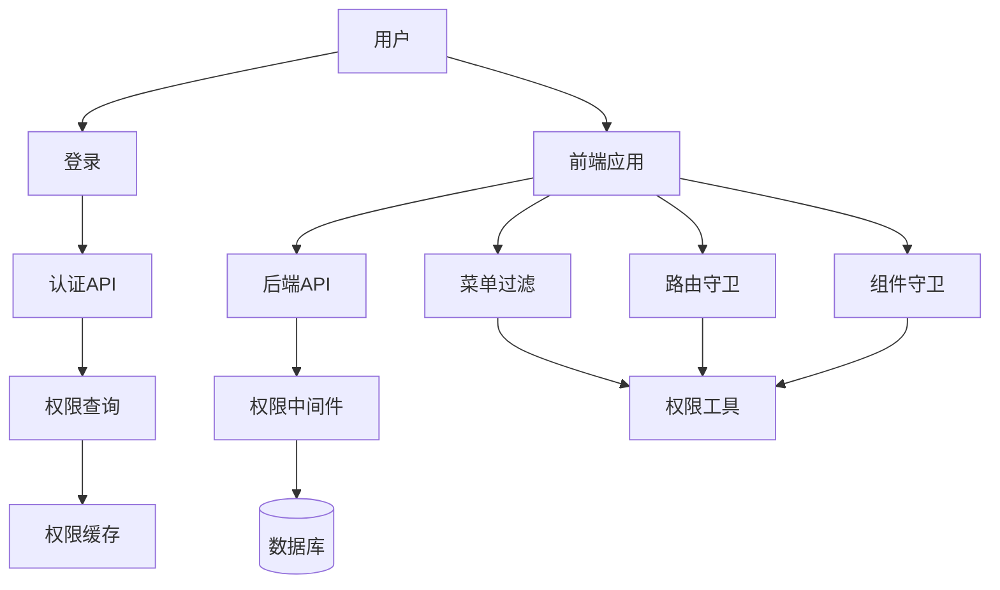

# Design Document

## Overview

RBAC权限系统采用前后端分离的架构，通过权限代码（Permission Code）实现细粒度的访问控制。系统包含权限定义、角色权限分配、用户权限查询、前端权限过滤和后端权限验证五个核心模块。

## Architecture

### 系统架构图



### 数据流

1. 用户登录 → 后端验证 → 返回用户信息和权限列表
2. 前端存储权限到 localStorage 和全局状态
3. 前端根据权限过滤菜单、路由和组件
4. 用户操作 → 前端检查权限 → 调用后端API
5. 后端中间件验证权限 → 执行业务逻辑

## Components and Interfaces

### 后端组件

#### 1. 权限查询API

**接口**: `GET /api/auth/permissions`

**响应**:
```json
{
  "permissions": [
    {
      "id": 1,
      "code": "employee:view",
      "name": "查看员工",
      "module": "employee"
    }
  ],
  "roles": [
    {
      "id": 1,
      "name": "部门经理"
    }
  ],
  "can_view_all_departments": true
}
```

#### 2. 角色权限管理API

**接口**:
- `GET /api/roles/:id/permissions` - 获取角色权限
- `PUT /api/roles/:id/permissions/batch` - 批量更新角色权限

**请求体**:
```json
{
  "permissionIds": [1, 2, 3, 4]
}
```

#### 3. 权限验证中间件

**文件**: `server/middleware/requirePermission.js`

**用法**:
```javascript
fastify.get('/api/employees',
  { preHandler: requirePermission('employee:view') },
  async (request, reply) => {
    // 业务逻辑
  }
)
```

**实现逻辑**:
1. 从请求中获取用户ID
2. 查询用户权限列表（带缓存）
3. 检查是否包含所需权限
4. 无权限返回403错误

### 前端组件

#### 1. 权限工具函数

**文件**: `src/utils/permission.js`

**函数**:
```javascript
// 检查单个权限
hasPermission(code: string): boolean

// 检查任意权限（OR逻辑）
hasAnyPermission(codes: string[]): boolean

// 检查所有权限（AND逻辑）
hasAllPermissions(codes: string[]): boolean

// 检查菜单权限
hasMenuPermission(menuKey: string): boolean

// 过滤菜单
filterMenusByPermission(menus: MenuItem[]): MenuItem[]
```

#### 2. 权限Context

**文件**: `src/contexts/PermissionContext.jsx`

**提供**:
```javascript
{
  permissions: string[],        // 权限代码列表
  roles: Role[],                // 角色列表
  canViewAllDepartments: boolean,
  hasPermission: (code) => boolean,
  hasAnyPermission: (codes) => boolean,
  hasAllPermissions: (codes) => boolean,
  refreshPermissions: () => Promise<void>
}
```

#### 3. 权限组件

**HasPermission组件**:
```jsx
<HasPermission permission="employee:edit">
  <button>编辑</button>
</HasPermission>
```

**PermissionRoute组件**:
```jsx
<PermissionRoute
  permission="employee:view"
  component={EmployeeManagement}
  fallback={<NoPermission />}
/>
```

#### 4. 权限Hooks

**文件**: `src/hooks/usePermission.js`

```javascript
// 单个权限检查
const hasEdit = usePermission('employee:edit')

// 多个权限检查
const canManage = useHasAnyPermission(['employee:edit', 'employee:delete'])
```

## Data Models

### 数据库表结构

#### permissions 表
```sql
CREATE TABLE permissions (
  id INT PRIMARY KEY AUTO_INCREMENT,
  code VARCHAR(100) UNIQUE NOT NULL,
  name VARCHAR(100) NOT NULL,
  module VARCHAR(50) NOT NULL,
  description TEXT,
  created_at TIMESTAMP DEFAULT CURRENT_TIMESTAMP
);

CREATE INDEX idx_permissions_module ON permissions(module);
CREATE INDEX idx_permissions_code ON permissions(code);
```

#### role_permissions 表
```sql
CREATE TABLE role_permissions (
  id INT PRIMARY KEY AUTO_INCREMENT,
  role_id INT NOT NULL,
  permission_id INT NOT NULL,
  created_at TIMESTAMP DEFAULT CURRENT_TIMESTAMP,
  FOREIGN KEY (role_id) REFERENCES roles(id) ON DELETE CASCADE,
  FOREIGN KEY (permission_id) REFERENCES permissions(id) ON DELETE CASCADE,
  UNIQUE KEY unique_role_permission (role_id, permission_id)
);

CREATE INDEX idx_role_permissions_role ON role_permissions(role_id);
```

### 权限代码规范

格式: `module:action`

**模块列表**:
- employee (员工管理)
- department (部门管理)
- position (职位管理)
- permission (权限管理)
- attendance (考勤管理)
- shift (班次管理)
- schedule (排班管理)
- leave (请假管理)
- overtime (加班管理)
- knowledge (知识库)
- exam (考试管理)
- statistics (统计报表)

**操作列表**:
- view (查看)
- create (创建)
- edit (编辑)
- delete (删除)
- approve (审核)
- manage (管理)
- settings (设置)

### 菜单权限映射

```javascript
const MENU_PERMISSIONS = {
  'employee': ['employee:view'],
  'department': ['department:view'],
  'position': ['position:view'],
  'permission': ['permission:view', 'role:manage'],
  'attendance': ['attendance:view', 'attendance:clock'],
  'shift': ['shift:view'],
  'schedule': ['schedule:view'],
  'leave': ['leave:view', 'leave:apply'],
  'overtime': ['overtime:view', 'overtime:apply'],
  'knowledge': ['knowledge:view'],
  'exam': ['exam:view'],
  'statistics': ['statistics:view']
}
```

## Error Handling

### 前端错误处理

1. **权限加载失败**: 显示错误提示，提供重试按钮
2. **无权限访问**: 重定向到403页面
3. **Token过期**: 清除本地数据，重定向到登录页

### 后端错误处理

1. **权限验证失败**: 返回403状态码
```json
{
  "error": "Permission denied",
  "message": "您没有权限执行此操作",
  "required_permission": "employee:edit"
}
```

2. **用户未登录**: 返回401状态码
```json
{
  "error": "Unauthorized",
  "message": "请先登录"
}
```

3. **权限不存在**: 返回404状态码
```json
{
  "error": "Permission not found",
  "message": "权限代码不存在"
}
```

## Testing Strategy

### 单元测试

1. **权限工具函数测试**
   - 测试 hasPermission 各种场景
   - 测试 hasAnyPermission 逻辑
   - 测试 hasAllPermissions 逻辑
   - 测试菜单过滤逻辑

2. **权限中间件测试**
   - 测试有权限的情况
   - 测试无权限的情况
   - 测试未登录的情况
   - 测试权限代码不存在的情况

### 集成测试

1. **登录流程测试**
   - 测试登录后权限数据获取
   - 测试权限数据存储
   - 测试权限Context初始化

2. **菜单过滤测试**
   - 测试不同角色看到的菜单
   - 测试父子菜单的过滤逻辑

3. **API权限测试**
   - 测试有权限调用API
   - 测试无权限调用API
   - 测试权限变更后的效果

### 端到端测试

1. **管理员场景**: 登录 → 查看所有菜单 → 访问所有页面 → 执行所有操作
2. **部门经理场景**: 登录 → 查看部分菜单 → 访问授权页面 → 执行授权操作
3. **普通员工场景**: 登录 → 查看基础菜单 → 访问基础页面 → 执行基础操作
4. **无权限场景**: 尝试访问无权限页面 → 看到403页面

## Performance Considerations

### 缓存策略

1. **前端缓存**:
   - 权限数据存储在 localStorage
   - 使用 Context 提供全局访问
   - 登录时加载，登出时清除

2. **后端缓存**:
   - 使用内存缓存用户权限（5分钟过期）
   - 权限变更时清除相关缓存

### 优化措施

1. **数据库优化**:
   - 为 permissions.code 添加索引
   - 为 role_permissions 添加复合索引

2. **查询优化**:
   - 使用 JOIN 一次性查询用户所有权限
   - 避免 N+1 查询问题

3. **前端优化**:
   - 菜单过滤结果缓存
   - 避免重复的权限检查

## Security Considerations

1. **前端权限检查仅用于UI控制**: 不能作为安全保障
2. **后端必须验证所有敏感操作**: 使用权限中间件
3. **权限代码不应暴露敏感信息**: 使用抽象的代码
4. **记录权限相关的操作日志**: 便于审计
5. **定期审查权限配置**: 避免权限过度分配
